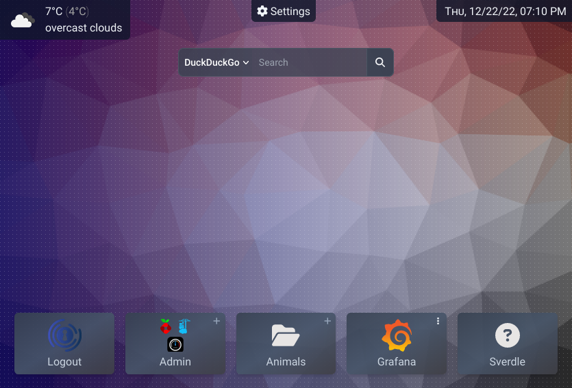

# Hubleys

## Hubleys - Brave New Dashboard

So you run a bunch of self-hosted services for multiple users but are tired of handing out links? No problem, Hubleys got you covered.

- separate dashboard per user, according to their groups/permissions
- all dashboard contents are predefined by the admin
- dashboard features:
    - link tiles, organized by folders
    - search engines with autocomplete
    - upcoming calendar events
- customizable & dynamic backgrounds
- current weather & forecast
- clock, stopwatch, timer

## Quick Demo

```shell
docker run -it --rm -e DEMO_MODE=1 -e ORIGIN=http://localhost:3000 -p3000:3000 ghcr.io/knrdl/hubleys-dashboard:edge
```

> Weather and unsplash backgrounds won't work in demo.



# Setup

## 1. Setup Docker Compose

```yaml
version: '2.4'

services:
  hubleys:
    image: ghcr.io/knrdl/hubleys-dashboard
    hostname: hubleys
    restart: unless-stopped
    environment:
      OPENWEATHERMAP_API_KEY: XXXXXXXXXXXXXXXXXXXXXXXXXXXXXXXX  # get a free api key: https://home.openweathermap.org/api_keys
      UNSPLASH_API_KEY: XXXXXXXXXXXXXXXXXXXXXXXXXXXXXXXXXXXXXXXXXXX  # get a free api key (Access Key): https://unsplash.com/oauth/applications
      ADMIN_USERIDS: user1, user2
    volumes:
      - ./data:/data  # run `chown -R 1000:1000 ./data` on the host to fix folder permissions
    networks:
      - proxy  # must be reachable by the reverse proxy
    mem_limit: 100m
```

File paths explained:

| Path                       | Type | Required | Description                                                                                                               |
|----------------------------|------|----------|---------------------------------------------------------------------------------------------------------------------------|
| `/data/`                   | 📂   | ☑        | holds all persistent data                                                                                                 |
| `/data/config.yml`         | 🗎   | ☑        | system config file (can be readonly)                                                                                      |
| `/data/logos/`             | 📂   |          | additional image files to reference in `config.yml`.<br/>hubleys also ships some [default icons](./static/fallback-logos) |
| `/data/users/backgrounds/` | 📂   |          | where user uploaded images are persisted                                                                                  |
| `/data/users/config/`      | 📂   |          | where user settings are persisted                                                                                         |
| `/app/client/favicon.png`  | 🗎   |          | provide a custom favicon                                                                                                  |

## 2. Configure Hubleys

Edit the contents of `/data/config.yml`. The demo example can be found [here](./docs/config.yml).

## 3. Configure reverse proxy and auth provider:

Hubleys uses forward auth (also known as webproxy auth) to get all relevant user info via http header:

- **Remote-User**: unique userID, must be present
- **Remote-Groups**: comma seperated group memberships
- **Remote-Name**: optional display name
- **Remote-Email**: optional email addr

See also: [Authelia docs](https://www.authelia.com/integration/trusted-header-sso/introduction/#response-headers)

Using [Caddy](https://caddyserver.com/) as reverse proxy a config may look like below:

```
hubleys.example.org {
	forward_auth authelia:9091 {
		method GET
		uri /api/verify?rd=https://login.example.org
		header_up X-Forwarded-Method {method}
		header_up X-Forwarded-Uri {uri}
		copy_headers Remote-User Remote-Groups Remote-Name Remote-Email
	}
	
	reverse_proxy hubleys:3000
}
```

As auth provider [Authelia](https://www.authelia.com/) can be used.

## 4. I need more icons

Please have a look here (thanks @FieldofClay):
* https://github.com/walkxcode/dashboard-icons
* https://simpleicons.org/
* https://github.com/Templarian/MaterialDesign

You can download additional icons into the `/data/logos` folder or just reference them via url in the `config.yml`