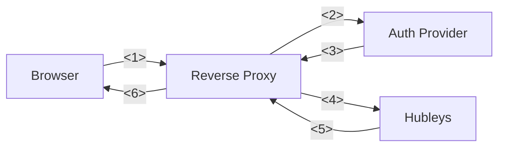

# Hubleys

## Hubleys - Brave New Dashboard

So you run a bunch of self-hosted services for multiple users but are tired of handing out links? No problem, Hubleys got you covered.

- separate dashboard per user, according to their groups/permissions
- all dashboard contents are predefined by the admin(s)
- dashboard features:
  - link tiles, organized by folders
  - search engines with autocomplete
  - upcoming calendar events
  - show messages to the users
- customizable & dynamic backgrounds
- current weather & forecast
- clock, stopwatch, timer

## Quick Demo

```shell
docker run -it --rm -e DEMO_MODE=1 -e ORIGIN=http://localhost:3000 -p127.0.0.1:3000:3000 ghcr.io/knrdl/hubleys-dashboard:edge
```

> Weather and unsplash backgrounds won't work in demo.


# Setup

## 1. Setup Docker Compose

```yaml
version: '2.4'

services:
  hubleys:
    image: ghcr.io/knrdl/hubleys-dashboard
    hostname: hubleys
    restart: unless-stopped
    environment:
      OPENWEATHERMAP_API_KEY: XXXXXXXXXXXXXXXXXXXXXXXXXXXXXXXX  # get a free api key: https://home.openweathermap.org/api_keys
      UNSPLASH_API_KEY: XXXXXXXXXXXXXXXXXXXXXXXXXXXXXXXXXXXXXXXXXXX  # get a free api key (Access Key): https://unsplash.com/oauth/applications
      ADMIN_USERIDS: user1, user2
    volumes:
      - ./data:/data  # run `chown -R 1000:1000 ./data` on the host to fix folder permissions
    networks:
      - proxy  # must be reachable by the reverse proxy
    mem_limit: 100m
```

Persistent files reside under `/data`. The file structure is auto-generated on startup:

| Path                       | Type | Description                                                                                                               |
| -------------------------- | ---- | ------------------------------------------------------------------------------------------------------------------------- |
| `/data/`                   | 📂   | holds all persistent data                                                                                                 |
| `/data/config.yml`         | 🗎    | system config file                                                                                      |
| `/data/logos/`             | 📂   | additional image files to reference in `config.yml`.<br/>hubleys also ships some [default icons](./static/fallback-logos) |
| `/data/users/backgrounds/` | 📂   | where user uploaded images are persisted                                                                                  |
| `/data/users/config/`      | 📂   | where user settings are persisted                                                                                         |
| `/data/users/default-config.json` | 🗎  | the user settings template. edit to predefine settings for new users                                                                                         |
| `/data/favicon.png`        | 🗎  | provide a custom favicon                  |

## 2. Configure Hubleys

Edit the contents of `./data/config.yml`. The default example can be found [here](./src/lib/server/sysconfig/default.yml). After a config change restart the application *OR* go to Settings → Admin → Reload application.

Fine-tuning is done via env vars defined [here](./Dockerfile#L50).

## 3. Configure reverse proxy + auth provider

Hubleys uses forward auth (also known as webproxy auth) to get all relevant user info via http header:

- **Remote-User**: unique userID, must be present
- **Remote-Groups**: comma separated group memberships
- **Remote-Name**: optional display name
- **Remote-Email**: optional email addr

See also: [Authelia docs](https://www.authelia.com/integration/trusted-header-sso/introduction/#response-headers)

### 3.0 How does it work?



1. the browser sends a request to your server
2. the reverse proxy forwards the request to your auth provider (aka IDP)
3. the auth provider checks the request
    - if the user is logged in, it sets the **Remote-User** response header (and the other headers explained above)
    - if the user is not logged in, it returns the login page
4. the reverse proxy checks and copies the **Remote-User** header into the request to Hubleys
5. Hubleys reads the **Remote-User** header and acts according to the user profile
6. send Hubleys response to the client


### 3.1 [Caddy](https://caddyserver.com/) + [Authelia](https://www.authelia.com/) example configuration

```
hubleys.example.org {
	forward_auth authelia:9091 {
		method GET
		uri /api/verify?rd=https://login.example.org
		header_up X-Forwarded-Method {method}
		header_up X-Forwarded-Uri {uri}
		copy_headers Remote-User Remote-Groups Remote-Name Remote-Email
	}

	reverse_proxy hubleys:3000
}
```

### 3.2 [Nginx](https://nginx.org) + [Authelia](https://www.authelia.com/) example configuration

```
location /authelia {
  internal;
  proxy_pass http://authelia:9091/api/verify;
  proxy_redirect off;
  proxy_pass_request_body off;
  proxy_set_header Content-Length "";
  # this must also be set in order to avoid status code 413 response
  client_max_body_size 0;
  proxy_set_header X-Forwarded-Proto $scheme;
  proxy_set_header X-Original-URL $scheme://$http_host$request_uri;
}

location / {
  proxy_pass            http://hubleys:3000/;
  auth_request          /authelia;
  auth_request_set      $target_url $scheme://$http_host$request_uri;
  proxy_set_header      Upgrade $http_upgrade;
  proxy_set_header      Connection $connection_upgrade;
  proxy_set_header      Remote-User $upstream_http_remote_user;
  proxy_set_header      Remote-Groups $upstream_http_remote_groups;
  proxy_set_header      Remote-Name $upstream_http_remote_name;
  proxy_set_header      Remote-Email $upstream_http_remote_email;
}
```

## 4. I need more icons

Please have a look here:

- https://github.com/walkxcode/dashboard-icons
- https://github.com/Templarian/MaterialDesign
- https://simpleicons.org/

You can download additional icons into the `/data/logos` folder or just reference the image via it's url in the `config.yml`
